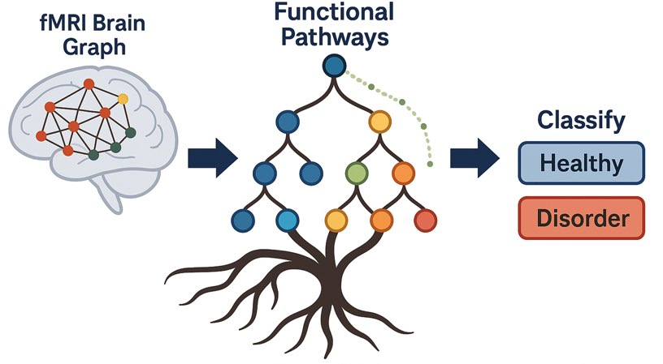
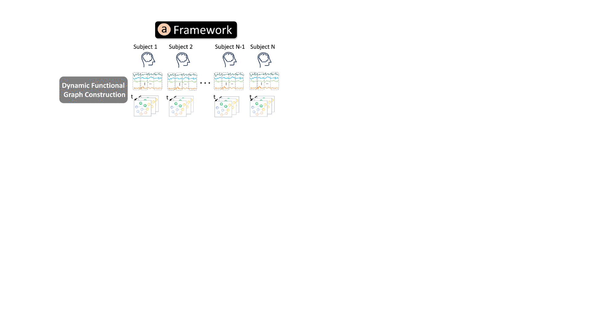
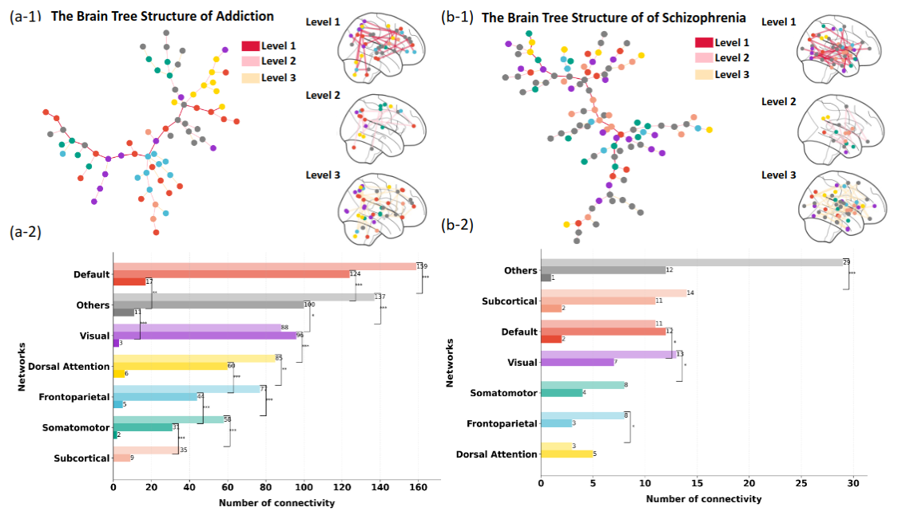
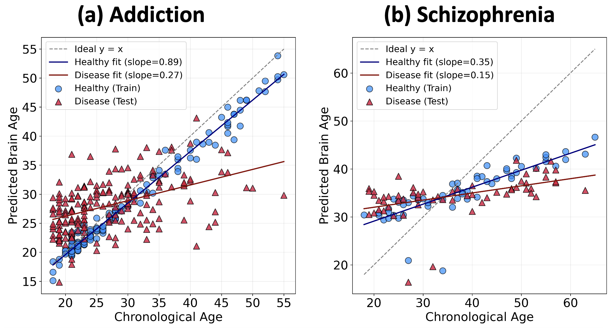
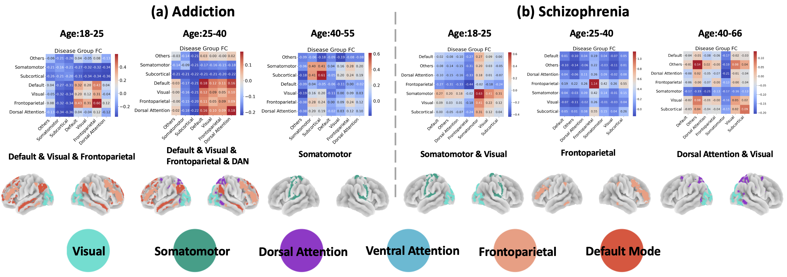

<p align="center">
  
</p>

<h2 align="center"><strong>NeuroTree: Hierarchical Functional Brain Pathway Decoding for Mental Health Disorders (ICML2025)</strong></h2>

<div align="center">
<a href="https://arxiv.org/abs/2502.18786"></a>
</div>

<div align="center">
    <a href="https://www.jun-ending.com/" target='_blank'>Jun-En Ding</a><sup>1</sup>&nbsp;&nbsp;&nbsp;
    <a href="https://users.cs.fiu.edu/~dluo/" target='_blank'>Dongsheng Luo</a><sup>2</sup>&nbsp;&nbsp;&nbsp;
    <a href="https://www.linkedin.com/in/chenwei-wu-498a3515a/" target='_blank'>Chenwei Wu</a><sup>3</sup>&nbsp;&nbsp;&nbsp;
    <a href="https://scholar.google.com/citations?user=jg5A1hwAAAAJ&hl=en" target='_blank'>Anna Zilverstand</a><sup>4</sup>&nbsp;&nbsp;&nbsp;
    <a href="https://profiles.mountsinai.org/kaustubh-r-kulkarni" target='_blank'>Kaustubh Kulkarni</a><sup>5</sup>&nbsp;&nbsp;&nbsp;
    <a href="https://www.stevens.edu/profile/fliu22" target='_blank'>Feng Liu</a><sup>1</sup>&nbsp;&nbsp;&nbsp;
    </br></br>
    <sup>1</sup>SIT (Brain Imaging & Graph Learning Lab)&nbsp;&nbsp;&nbsp;
    <sup>2</sup>FIU&nbsp;&nbsp;&nbsp;
    <sup>3</sup>UMich&nbsp;&nbsp;&nbsp;
    <sup>4</sup>UMN&nbsp;&nbsp;&nbsp;
    <sup>5</sup>Mount Sinai&nbsp;&nbsp;&nbsp;  
</div>


# 🧠 Overview

In this work, we propose a novel framework called $\textbf{NuroTree}$ that contributes to computational neuroscience by integrating demographic information into Neural ODEs for brain network modeling via k-hop graph convolution, investigating addiction and schizophrenia datasets to decode fMRI signals and construct disease-specific brain trees with hierarchical functional subnetworks, and achieving state-of-the-art classification performance while effectively interpreting how these disorders alter functional connectivity related to brain age.

<p align="center">
    
</p>

### 🔧 Installation
1. Clone the repository:
   ```bash
   git clone https://github.com/Ding1119/NeuroTree.git
   cd NeuroTree
   ```
2. Install dependencies:
   ```bash
   pip install -r requirements.txt
   ```

---

<p>
   &nbsp;<strong>Download Processed Data</strong>
</p>


Processed data data file can be download from Lab google drive [Here](https://drive.google.com/drive/folders/1_jSPlO_wCqJ9hGrirt4T35SjdOUT0Ytp?usp=sharing) and put your local path ```./datasets```.

## 🗂️ Repository Structure

```
NEUROTREE/
├── brain_tree_cobre_visualization/     # Visualization scripts for COBRE dataset
├── datasets/                           # Please place the fMRI and .csv files downloaded from Google Drive here 
├── data_handler/                       # Dataset preprocessing and loading utilities
├── models/                             # ODE-bsed GCN model architectures
├── Tutorial/                           # Example jupyter notebooks 
├── visualization/                      # Plotting and visualization .py code
├── main.py                             # Main training pipeline
├── run_main_cannabis.sh                # Shell script to run training on Cannabis dataset
├── run_main_COBRE.sh                   # Shell script to run training on COBRE dataset
├── training_eval_utils.py              # Training and evaluation helper functions
├── tree_trunk_utils.py                 # High-order tree path extraction utilities
├── utils.py                            # Miscellaneous utility functions
└── README.md                           # Project documentation
```

## 🚀 Getting Started

To run the training script with configurable parameters, using the cannabis dataset as an example:

```bash
bash run_main_cannabis.sh
```
### 🔬 NeuroTasks: Classifying Brain Disorders & Estimating Brain Age

You can set the argparse **classes=2** for graph classification or **classes=1** for brain age prediction task in our framework.

```bash
data_type=cannabis
brain_tree_plot=False
num_epochs=5
batch_size=4
num_timesteps=2
num_nodes=90
input_dim=405
hidden_dim=64
num_classes=2

python main.py \
  --data_type ${data_type} \
  --brain_tree_plot ${brain_tree_plot} \
  --num_epochs ${num_epochs} \
  --batch_size ${batch_size} \
  --num_timesteps ${num_timesteps} \
  --num_nodes ${num_nodes} \
  --input_dim ${input_dim} \
  --hidden_dim ${hidden_dim} \
  --num_classes ${num_classes}
```

### :deciduous_tree: Visualize the Brain Tree of Different Mental Disorders

|  |
|:----------------------------------------------------:|
| The visualization of the brain tree illustrates psychiatric disorders structured into three hierarchical trunk levels. |

### 🕒 Brain Age Estimation

|  |
|:----------------------------------------------------:|
| We predict brain age from fMRI between chronological age of gaps for mental disorders. These gaps can effectively measure brain differences between disease populations and healthy controls. |

### 🟢🟡 Age-Related Brain Network Changes in Addiction and Schizophrenia

|  |
|:----------------------------------------------------:|
| Predicted FC changes in different age groups and affiliated functional subnetworks. |

## Acknowledgement

We would like to express our sincere gratitude to **Kaustubh R. Kulkarni** and **Dr. Xiaosi Gu** from **Mount Sinai** for generously providing open-access addiction-related neuroimaging data and for their valuable contributions to addiction neuroscience research.

For further context on their work, we encourage readers to explore the following publication by Kaustubh R. Kulkarni:

📄 [*An Interpretable and Predictive Connectivity-Based Neural Signature for Chronic Cannabis Use*](https://www.sciencedirect.com/science/article/pii/S2451902222001264)


## 📄 Citation

If you use this codebase, please cite:

```
@article{your2025neurotree,
  title={NEUROTREE: Hierarchical Functional Brain Pathway Decoding for Mental Health Disorders},
  author={Your Name et al.},
  journal={[Journal Name]},
  year={2025}
}
```

## 📬 Contact

Welcome to contact the [author](https://www.jun-ending.com/) at jding17@stevens.edu or collaborations if you have any questions about using the code. Note that experimental performance may vary slightly due to differences in computer hardware and environment.
